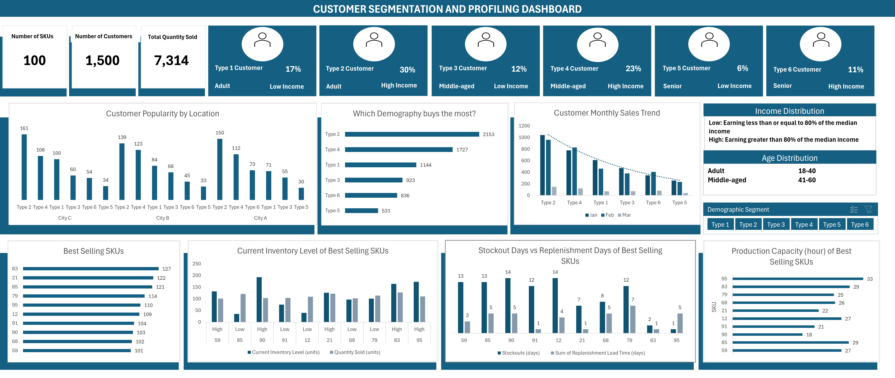

# Refine Production Planning: Utilizing Customer Segmentation and Data insights for Supply Chain

## Table of Contents

- [Business Problem](#business-problem)
- [Rationale for the Project](#rationale-for-the-project)
- [Aim of the Project](#aim-of-the-project)
- [Data Description](#data-description)
- [Tech Stack](#tech-stack)
- [Project Scope](#project-scope)
- [Insights and Recommendations](#insights-and-recommendations)
- [Implementation Pathway](#implementation-pathway)

## Business Problem
SmartHome Solutions Inc. faces a significant challenge in optimizing its supply chain and production planning. The traditional approach to production planning, based primarily on historical data and market forecasts, poses various obstacles:
 - Inefficient Production: Relying on historical data often results in overproduction or underproduction, causing operational inefficiencies and increased costs. 
 - Customer Disconnection: The company lacks a deep understanding of its diverse customer base, making it challenging to align production with specific customer demands. 
 - Inventory Management: Inefficient production planning has led to excess inventory, tying up valuable resources and impacting the company's profitability. 

## Rationale for the Project
The logistics and supply chain industry is undergoing a significant transformation, necessitating a data-driven approach. Here are the top five reasons highlighting the significance of this project:
 - Operational Efficiency: By leveraging customer data, SmartHome Solutions Inc. can streamline production processes, reduce operational costs, and optimize resource allocation, leading to a more efficient supply chain. 
 - Customer Satisfaction: Understanding customer preferences and demand patterns enables the company to provide better product availability and timely deliveries, ultimately enhancing customer satisfaction. 
 - Competitive Edge: In a dynamic market, data-driven supply chain planning gives SmartHome Solutions Inc. a competitive advantage by enabling rapid adaptation to market changes and customer demands. 
 - Cost Savings: Eliminating overproduction and minimizing excess inventory leads to significant cost reductions, bolstering the company's financial health. 
 - Sustainability: Reducing waste through accurate production planning aligns with the company's sustainability goals, demonstrating corporate responsibility. 

## Aim of the Project
The primary objectives of this project are:
- Customer Segmentation: To segment and profile SmartHome Solutions Inc.'s customer base to gain insights into their preferences, buying behaviors, and geographic distribution. 
- Data-Driven Planning: To enhance production planning, inventory management, and distribution strategies based on customer segments, thereby reducing overproduction and minimizing excess inventory. 
- Customer-Centric Approach: To improve on-time deliveries, increase customer satisfaction, and align production with customer demands. 

## Data Description
This case study contains 4 datasets and they are as follows;
- Customer Data:
  - Customer_ID: A unique identifier for each customer.
  - Age (years): The age of the customer in years.
  - Gender: The gender of the customer (e.g., Male, Female, Other).
  - Income ($): The annual income of the customer in dollars.
  - Geographic Location: The customer's geographic location (e.g., city, state).

- Sales Data:
  - Transaction_ID: A unique identifier for each sales transaction.
  - Customer_ID: The identifier linking each sale to a customer.
  - Product SKU: Unique identifier for each product.
  - Quantity Sold (units): The number of units sold for each product.
  - Timestamp: The date and time of each sales transaction.
 
- Inventory Data:
  - Product SKU: Unique identifier for each product, linking to sales data.
  - Current Inventory Level (units): The number of units of each product currently in inventory.
  - Stockout (days): The number of days a product has been out of stock.
  - Replenishment Lead time (days): The number of days it takes to replenish inventory.
  - Storage Location: The location where the product is stored.
  - Shelf Life (days): The number of days a product can be stored before expiration.
 
- Production Data:
  - Product SKU: Unique identifier for each product, linking to sales and inventory data.
  - Production Schedule_ID: A unique identifier for each production schedule.
  - Lead Time (days): The time required for manufacturing and distribution.
  - Production Capacities (units per hour): The number of units that can be produced per hour.
  - Resource Allocation: Information about the allocation of resources for production.

## Tech Stack
Tool– Microsoft Excel
- Utilized for creating the interactive dashboard, data visualization, and reporting.
- Data Processing Tools: Leveraging Excel's data manipulation and analysis functions.
- Visualization Tools: Employing Excel's charts, graphs, and pivot tables for order and delivery data visualization.

## Project Scope
- Exploratory Data Analysis: Explore the data to understand its characteristics and discover patterns. 
- Data Analysis: This includes the Customer segmentation, profiling, production planning and performance monitoring.
- Visualization and Reporting: Create interactive dashboards in Excel to visualize insights.  
- Recommendation: Integrate the data-driven supply chain planning process into the company's existing systems and processes.

## Insights and Recommendations

You can interact with the dashboard [here]()

### General Insights

1. Diverse Customer Base: The even distribution across different ages and the presence of various gender groups indicate a wide-ranging customer base.

2. Income and Age Group Correlation: The majority of customers being adults with High income suggests priority to SKUs for this customer sect.

3. Geographic Variability: Different preferences in different cities indicate the need for region-specific strategies.

4. Product Preferences by Segment: Each customer segment (Type 1 to Type 6) shows distinct preferences for certain SKUs, highlighting the importance of tailored product offerings.

5. High Value SKUs: The identification of top SKU bought by customers suggests a focused demand for specific products.

6. Sales Variability and Seasonality: Sales varies for different month when in different locations by different Customer Types.

### Recommendations

1. Product Strategy:
   - Diversification: Develop products catering to the diverse needs of different age and income groups.
   - Tailoring for High-Value SKUs: Focus production on top SKU from the customer segment, ensuring they are well-stocked and readily available.

2. Inventory Management:
   - Dynamic Stocking: Adjust inventory levels based on sales trends of high-value SKUs for each customer type.
   - Regional Focus: Tailor inventory to regional preferences, ensuring that popular products in each city are adequately stocked based customer preferences.

3. Marketing and Sales:
   - Segment-Specific Campaigns: Develop targeted marketing campaigns for each customer segment (Type 1 to Type 6), focusing on their preferred SKUs.
   - Promotional Timing: Align marketing campaigns with peak sales periods to capitalise on increased demand.

4. Production Planning:
   - Demand-Driven Production: Adjust production schedules based on the sales trends of the top SKUs which are the specific demands of each customer segment.
   - Efficiency in Low-Demand Products: For the lower-value SKUs, which are the least sort after SKUs, adopt a lean production approach to minimise excess inventory.

5. Regional Strategies:
   - Localized Offerings: Customize product offerings and stock levels based on the preferences in Cities A, B, and C.
   - Distribution Optimization: Optimize distribution and logistics to cater to the unique demands of each geographic location.

6. Data-Driven Approach:
   - Continuous Monitoring: Regularly analyze sales data to adapt strategies in real-time.
   - Feedback Loops: Use customer feedback to refine product offerings and marketing strategies.

7. Customer Engagement:
   - Community Building: Engage with different customer groups to build brand loyalty and gain deeper insights into their preferences.
   - Responsive Customer Service: Provide excellent customer service, especially to the dominant adult low-income segment, to foster long-term relationships.

### Implementation Pathway:

- Short-Term: Focus on inventory adjustments and marketing campaigns targeting key segments and high-value SKUs.
- Medium-Term: Develop and refine products based on customer segment feedback and sales data analysis.
- Long-Term: Invest in technology and processes that enhance understanding of customer preferences and market dynamics, enabling agile and responsive supply chain management.

By adopting these recommendations, SmartHome Solutions Inc. can better align its products and services with the diverse needs of its customer base, optimising both customer satisfaction and operational efficiency.
